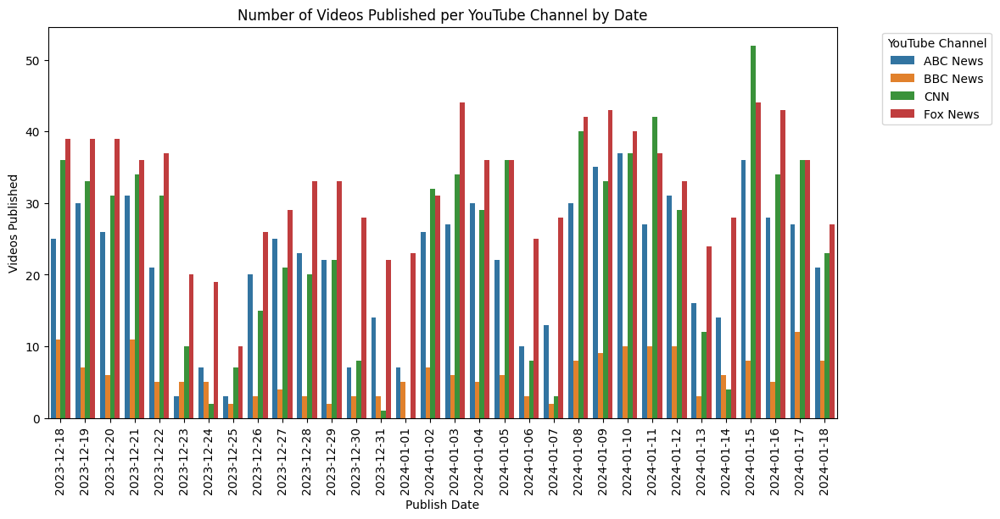

#  YouTube Transcript Web Scraping

## Description
This project utilizes <a href="https://pypi.org/project/scrapetube/">scrapetube</a> and <a href="https://pytube.io/en/latest/">pytube</a> to scrape four YouTube chanels: <a href="https://www.youtube.com/@ABCNews">ABC News</a>, <a href="https://www.youtube.com/@CNN">CNN</a>, <a href="https://www.youtube.com/@BBCNews">BBC News</a>, and <a href="https://www.youtube.com/@FoxNews">Fox News</a>. Data collected by the scraper include video id, video publish date, video source channel, video description, and transcript. The script will scrape every video published between the current date and a date specified by the user. I plan into implement different NLP techniques with this dataset in the future. Future projects can include Named Entity Recognition (NER), Topic Modeling, etc. 

## Files
### youtube_transcript_scraper.py
This is the file that scrapes the YouTube videos. Scrapes from current date to a user specified date of the format 'YYYY-MM-DD'. The results will be exported to youtube_news_transcripts.csv

usage:

python youtube_transcript_scraper.py <date>

### eda.ipynb
This is an exploratory data analysis of the scraped data. This includes some example information that can be observed from the data using plots. 

These example plots cover 2672 videos published from 2023-12-18 to 2024-01-18.

*This plot shows the distribution of videos published by each channel over the date range. This gives a feel for where the bulk of the news videos are coming from and who is publishing the most.*

*This plot shows the trend in the number of videos mentioning 'United States' over the date range. Plots like these can show trends in what countries are being talked about in the news.*

*This graph takes the top five most mentioned countries in the date range. Continuing on the idea from the previous figure, this can give insight into what countries are being talked about in the news.*